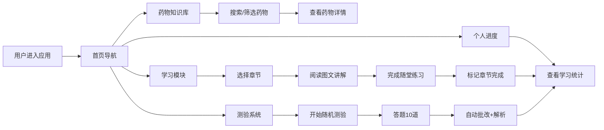

## 1. 产品概述

"你的药你知道"是一款面向医学生、医务人员及普通大众的药物学习应用，旨在提供结构化的药物知识学习、章节式课程学习、随机测验和个人学习进度追踪功能。通过系统化的学习路径和丰富的交互体验，帮助用户高效掌握药理学知识。

## 2. 核心功能

### 2.1 功能模块

1. **首页/导航页**：应用概览、模块入口、学习进度摘要
2. **药物知识库**：按药理分类展示药物列表，支持搜索、分类筛选，每种药物包含名称、适应症、作用机制、不良反应、禁忌症、常用剂量等结构化字段
3. **学习模块**：按章节组织学习内容（如"抗生素"、"心血管药物"），每章包含图文讲解和随堂选择题
4. **测验系统**：支持随机生成10道单选题，自动批改并给出每道题的解析
5. **个人学习进度**：记录已完成章节、各章节得分、测验历史、总体学习统计

### 2.3 页面详情

| 页面名称 | 模块名称 | 功能描述 |
|---------|---------|---------|
| 首页 | 导航卡片 | 展示4大功能模块的入口卡片，附带图标和简介 |
| 首页 | 进度概览 | 展示总体学习进度条、已完成章节数、最近测验得分 |
| 药物知识库 | 搜索筛选区 | 顶部搜索框（按名称/适应症搜索）、分类标签筛选栏 |
| 药物知识库 | 药物列表 | 卡片式展示药物列表，点击查看详情 |
| 药物知识库 | 药物详情 | 结构化展示药物的全部信息字段 |
| 学习模块 | 章节列表 | 展示所有章节及其学习进度状态（未开始/学习中/已完成） |
| 学习模块 | 章节详情 | 左侧章节导航，右侧图文讲解内容，底部随堂选择题 |
| 测验系统 | 测验配置 | 选择题目难度、分类（可选），开始测验按钮 |
| 测验系统 | 答题界面 | 逐题展示单选题，进度条，提交答案 |
| 测验系统 | 结果页面 | 得分统计，每道题的对错标记、正确答案、详细解析 |
| 个人进度 | 统计总览 | 学习天数、完成章节数、平均测验得分、正确率等统计数据 |
| 个人进度 | 章节进度 | 各章节完成状态和得分详情列表 |
| 个人进度 | 测验历史 | 历史测验记录列表，可查看详细结果 |

## 3. 核心流程

## 4. 用户界面设计

### 4.1 设计风格

- **主色调**：医疗蓝（#2563EB）作为主色，体现专业和信任感；搭配清新的青绿色（#10B981）作为强调色
- **辅助色**：暖橙色（#F59E0B）用于警示/重要提示，浅灰（#F3F4F6）作为背景
- **按钮风格**：圆角8px，悬停时有轻微阴影和颜色加深效果
- **字体**：标题使用"Noto Serif SC"（衬线体，体现学术感），正文使用"Noto Sans SC"（无衬线体，易读性好）
- **布局风格**：卡片式布局，清晰的信息层级，充足的留白
- **图标风格**：使用Lucide图标库，线条简洁

### 4.2 页面设计概要

| 页面名称 | 模块名称 | UI元素 |
|---------|---------|--------|
| 首页 | 导航卡片 | 4个大卡片网格布局，每个包含图标、标题、描述、进入按钮，悬停时有上浮动画 |
| 首页 | 进度概览 | 顶部区域，圆形进度环+统计数字卡片 |
| 药物知识库 | 搜索筛选区 | 搜索框带放大镜图标，分类标签使用圆角胶囊样式，选中态填充主色 |
| 药物知识库 | 药物卡片 | 卡片包含药物名称（大号字体）、分类标签、适应症摘要，点击展开详情 |
| 学习模块 | 章节列表 | 左侧垂直列表，每项显示章节名称、完成状态图标、得分徽章 |
| 学习模块 | 章节内容 | 右侧内容区，标题+段落+图片占位+重点内容高亮框，底部测验题卡片 |
| 测验系统 | 答题界面 | 居中布局，题号进度条，题目文字加大加粗，选项使用圆角卡片，选中后高亮 |
| 测验系统 | 结果页面 | 顶部得分大字展示，答对/答错图标，下方逐题展示解析 |
| 个人进度 | 统计区 | 数字卡片网格，每个卡片包含图标、数值、标签 |

### 4.3 响应式设计

- 桌面端优先（>=1024px），采用多栏布局
- 平板端（768px-1024px）：调整为双栏或单栏，缩小间距
- 移动端（<768px）：全部单栏布局，底部导航栏代替顶部导航，触摸区域扩大
