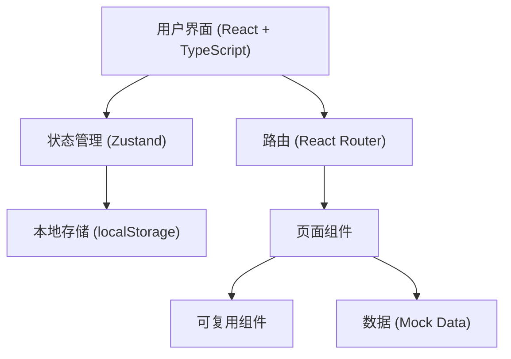
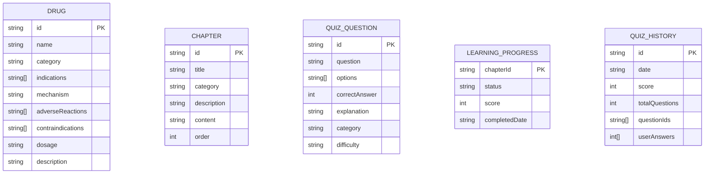

## 1. 架构设计



## 2. 技术说明

- **前端框架**：React@18 + TypeScript
- **构建工具**：Vite
- **样式方案**：TailwindCSS@3
- **状态管理**：Zustand（轻量级状态管理，存储学习进度、当前测验状态等）
- **路由**：react-router-dom@6
- **图标库**：lucide-react
- **数据持久化**：localStorage（存储学习进度、测验历史）
- **后端**：无（纯前端应用，使用Mock数据）
- **数据来源**：内置的药物数据、章节内容、测验题库（Mock数据）

## 3. 路由定义

| 路由路径 | 页面用途 |
|---------|---------|
| `/` | 首页 - 导航和进度概览 |
| `/drugs` | 药物知识库列表页 |
| `/drugs/:id` | 药物详情页 |
| `/learn` | 学习模块章节列表页 |
| `/learn/:chapterId` | 章节学习详情页 |
| `/quiz` | 测验系统首页/配置页 |
| `/quiz/active` | 测验答题界面 |
| `/quiz/result` | 测验结果页面 |
| `/progress` | 个人学习进度追踪页 |

## 4. 数据模型

### 4.1 数据模型定义



### 4.2 Mock数据结构

药物数据（Drugs）：
- 包含至少20种常见药物，覆盖抗生素、心血管、消化系统、神经系统等主要分类

章节数据（Chapters）：
- 包含至少6个章节：抗生素、心血管药物、消化系统药物、呼吸系统药物、神经系统药物、内分泌系统药物
- 每章包含图文讲解内容和至少3道随堂选择题

题库数据（Quiz Questions）：
- 包含至少50道单选题，覆盖各章节内容，附带答案和详细解析

## 5. 项目文件结构

```
src/
├── components/          # 可复用组件
│   ├── Layout/          # 布局组件（导航栏、侧边栏等）
│   ├── DrugCard.tsx     # 药物卡片
│   ├── ChapterCard.tsx  # 章节卡片
│   ├── ProgressBar.tsx  # 进度条
│   └── QuestionCard.tsx # 题目卡片
├── pages/               # 页面组件
│   ├── Home.tsx
│   ├── DrugList.tsx
│   ├── DrugDetail.tsx
│   ├── LearnList.tsx
│   ├── LearnDetail.tsx
│   ├── QuizHome.tsx
│   ├── QuizActive.tsx
│   ├── QuizResult.tsx
│   └── Progress.tsx
├── data/                # Mock数据
│   ├── drugs.ts
│   ├── chapters.ts
│   └── questions.ts
├── store/               # Zustand状态管理
│   └── useStore.ts
├── types/               # TypeScript类型定义
│   └── index.ts
├── utils/               # 工具函数
│   └── helpers.ts
├── App.tsx
├── main.tsx
└── index.css
```
